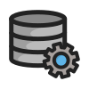

  

# Data engineering Meetup-in-a-Box

The data engineering Meetup-in-a-Box is a collection of guides, resources, and support for those who are interested in data engineering and want to organize a successful meetup in their area. It’s also a place where organizers can support each other, share ideas, and learn from each other. Whether it's your first time or you’ve done it many times before, our resources (and support for you at every step) will help you organize a successful meetup!

## Why start a data engineering meetup?

Meetups are a great way to get involved and support your local data engineering community. Some other benefits are: knowledge sharing, networking, staying updated on trends, career opportunities, and leadership skill development.

## Guide

Check if a DE meetup already exists in your area

Before trying to start a new meetup, check to see if one already exists that you could join instead.

If there is already a meetup in your area and you would like to get involved, let us know and we can connect you with the organizers and find opportunities for you to contribute.

If you can't find one in your area, we can help you get one started.

Where can I get support?

Join our [DE meetup organizers group](https://community.dataengineering.wiki/spaces/12260337) to get support and share meetup ideas with other data engineering organizers around the world. You can also reach out to us at [community@dataengineering.wiki](mailto:community@dataengineering.wiki).

Below are a few ways we can help:

- We can help connect you with sponsors and speakers
- We can help cover organizing costs on meetup when you join our [meetup pro network](https://www.meetup.com/pro/data-engineering/)

Finding members

Meetup.com does a great job of helping you find new members when you start a group but we will also help promote your group via social media and our website.

Finding speakers

We usually suggest that anyone from the community is welcome to be a speaker as long as they are technical and knowledgeable! There are many different ways to find speakers such as reaching out to the Data Engineering Community Team ([community@dataengineering.wiki](mailto:community@dataengineering.wiki)), asking around in your network, connecting with people in [our community](https://dataengineering.wiki/Community/Community), messaging local community members on meetup.com, and more.

Ask your speaker to prepare and provide the below information as you will likely need it later when creating the event:

- Full Name and Title
- Bio (short paragraph)
- LinkedIn
- Title of the Talk
- Talk abstract
- Length of talk

## Resources

- [DE Meetup Organizers Group](https://community.dataengineering.wiki/spaces/12260337)
- [Meetup Group Template](https://docs.google.com/document/d/1O30eObTspVQ9THZndPMvlZLjARMYXPDfB8GxtsABwPE/edit?usp=sharing)
- [Meetup Event Checklist](https://docs.google.com/document/d/1Y05CaLGHu8W-Yat0dGSo7zE6ubQx5y2qNxEguspEmPs/edit?usp=sharing)
